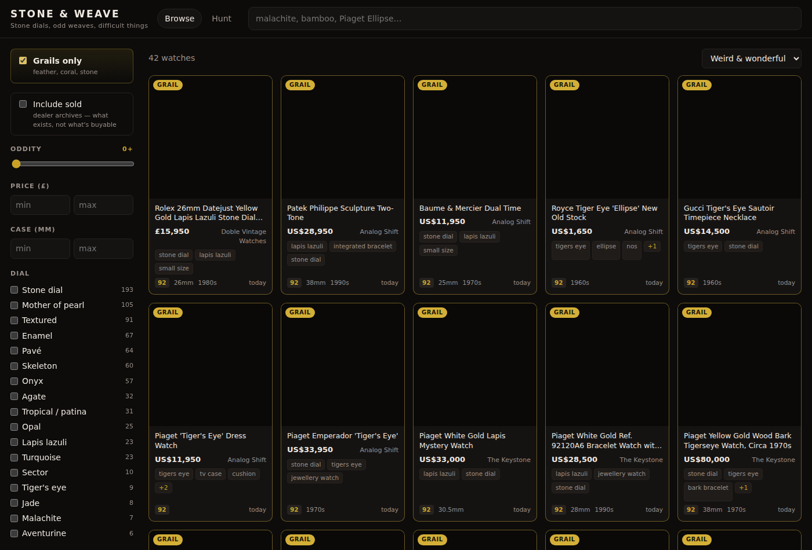
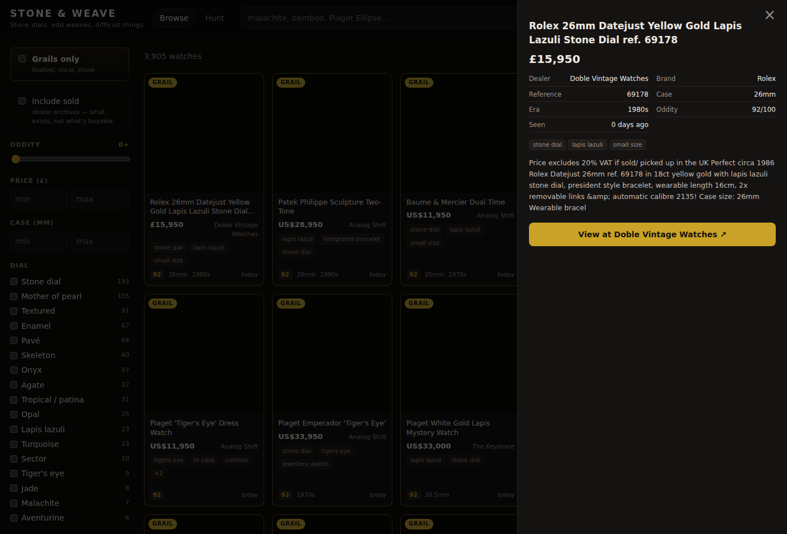
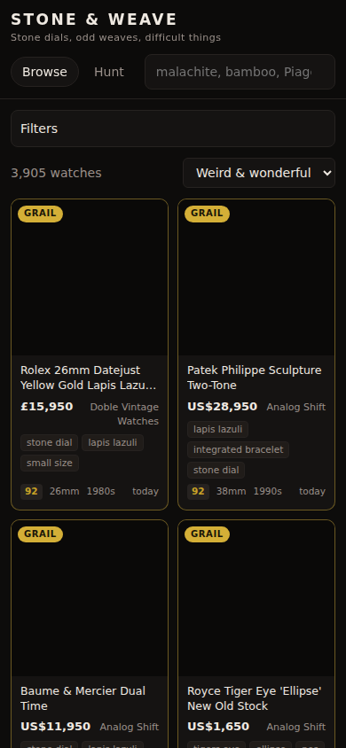

<h1>Stone &amp; Weave</h1>

<p><em>Stone dials, odd weaves, difficult things.</em></p>

<p>
  <a href="https://stoneandweave.vercel.app"><strong>Live site →</strong></a>
</p>

A discovery engine for vintage and obscure watches. It crawls dealer inventories
on a schedule, scores every piece for how *strange* it is, and pushes the good
ones to your phone.

**It costs £0/month to run.** No server, no database, no hosting bill. GitHub
Actions does the crawling, the repo is the database, and the site is static.



---

## The problem

Most watch sites let you search for what you already know to ask for. That works
if you want a Submariner. It's useless if what you actually like is *hard to
name*: a malachite dial, a hammered bracelet, a Piaget with a tiger's eye face
and a case shape that doesn't have a word for it.

That inventory is scattered across dozens of dealer sites, Instagram accounts
and marketplaces, and the good pieces sell in hours. Nothing aggregates it, and
nothing tells you when something odd appears.

## The idea: score strangeness, not relevance

Every listing gets an **oddity score** from 0 to 100.

| Watch | Score | Why |
|---|---|---|
| Cartier Tank Louis, yellow gold | 5 | Lovely. Ordinary. |
| Rolex 5513, gilt tropical dial | 30 | Patina is interesting, but common enough |
| Universal Genève, beads-of-rice bracelet | 35 | One unusual feature |
| Seiko 6139 bullhead chronograph | 45 | Odd case |
| Piaget, onyx dial, cobra bracelet | 71 | Two unusual features, different categories |
| Piaget feather dial | 92 | Grail |
| Vacheron, coral dial + woven bracelet + hammered case | 94 | Grail, and three categories deep |

Sort by *Weird & wonderful* and the strange things float up. That's the whole
product: **surfacing things you didn't know to search for.**

Three rules make the score mean something:

**Crossing categories wins.** A stone dial *and* an odd weave beats two unusual
dials, because that combination is what makes a watch genuinely rare.

**One feature is paid once.** A lapis dial carries both `lapis-lazuli` and the
implied `stone-dial`, but that's one physical feature, not two. Tags are grouped
into families and only the rarest member of each scores. A bark-finish case
matched `bark` + `hammered` + `textured` and scored 97 — above real grails —
until families fixed it. It now scores 64.

**Grails outrank everything.** Feather and coral dials, malachite, lapis,
tiger's eye. Floored at 92, badged, pushed at high priority.

### The taxonomy was mined, not guessed

I pulled the full 632-piece catalogue of [Doble Vintage
Watches](https://www.doblevintagewatches.com) — the best in the world at exactly
this kind of watch — and counted what they actually say:

```
gold(539) dial(401) diamond(334) cobra(88) bamboo(71) stone(69)
ellipse(65) snowflake(32) onyx(27) lapis(25) feather(23) rope(12)
corn(10) claw(10) jade(10) ...
```

That's the vocabulary. 57 tag rules across dial, bracelet, case and character —
`cobra`, `bamboo`, `beads-of-rice`, `bullhead`, `hooded-lugs`, `rhodochrosite`.
It lives in [`crawler/src/taxonomy.yml`](crawler/src/taxonomy.yml) as editable
YAML, so tuning it needs no code change.

## Sources

| Source | Method | Note |
|---|---|---|
| Shopify dealers | `/products.json` | Bulk, structured, no API key |
| Squarespace / Wix dealers | sitemap → schema.org JSON-LD | No bulk feed, so one page at a time |
| Subdial (13,638 listings) | sitemap, **pre-filtered on slugs** | Tag-matching the URL slug first cut it to 277 fetches — 98% saved |
| eBay | Browse API | Optional; skips cleanly with no credentials |
| Chrono24, Instagram | **link-out only** | No usable API and they block crawlers |

Every dealer was probed live before being added, and the ones that failed stay
listed in [`sources/dealers.yml`](sources/dealers.yml) under `excluded:` *with
the reason*, so nobody wastes an afternoon re-probing them.

Chrono24 and Instagram are deliberately **not** scraped. Instead there's a Hunt
tab of pre-built saved searches and a curated account directory — one click
away, honest about the boundary.

## Architecture

```
Actions (every 6h)  →  data/*.json (committed)  →  static site
                     └→ diff vs watchlist.yml   →  ntfy push
```

Git history *is* the price history. `firstSeen` and `priceHistory` only exist
because the same listing is crawled repeatedly, and they drive "new today",
"biggest price drop" and "longest listed" (stale means negotiable).

The data is split so the browser only pays for what it shows: everything for
sale loads up front (4.7 MB), and the dealers' **sold archives** (6 MB) are
fetched only if you ask for them. Sold pieces are kept deliberately — that
archive is how you learn what exists and what it went for.

<p align="center">
  
  
</p>

## Things that went wrong

Most of the real work was finding out where naive versions quietly lie:

- **`featherlight` matched as a feather dial.** Grails fire a phone alert, so a
  false positive is expensive. Same for a `coral red` dial, which is a colour,
  not a coral one. Grail patterns are strict now, and tested.
- **A dealer recycled a URL slug.** A birch-wood dial was sitting on a
  `...malachite...` URL and scored as a grail. The slug is now only trusted when
  the page copy is too thin to stand on its own.
- **A Rolex encyclopaedia scored as a grail**, because its blurb names every
  dial variant Rolex ever made. Books, winders and watch rolls are filtered out.
- **Dealer copy offering *"also available in lapis and aventurine"*** sprayed
  three stone tags onto a plainly-titled Onyx Datejust. The title settles it
  now; body copy naming three or more stones reads as a catalogue.
- **Squarespace answered 406** to a strict `Accept: application/xml` on its
  sitemap, which silently produced zero listings from the best dealer in the set.
- **Filtering sold stock cut that dealer from 631 pieces to 2.** Technically
  correct, strategically wrong — they keep their sold catalogue up as a
  reference archive. Sold is now marked, not dropped.

## Data integrity

Built so a bad afternoon can't destroy the history:

- `firstSeen` is never overwritten.
- A listing missing from **one** crawl is not deleted — it takes two consecutive
  absences to archive, so a five-minute dealer outage doesn't wipe them.
- A source that errors is skipped entirely rather than aged out, and the UI says
  so rather than pretending the inventory shrank.

## Crawling politely

Public product feeds and schema.org markup only. Nothing behind a login, nothing
that breaks a robots policy, no site that doesn't offer a feed. Identifying
User-Agent linking back here, one host at a time with a delay, and images are
hotlinked to dealer CDNs rather than copied.

## Running it

```bash
pnpm install
pnpm crawl      # writes data/*.json
pnpm dev        # http://localhost:5173
pnpm test       # taxonomy regression tests
```

Tuning is all YAML — [`taxonomy.yml`](crawler/src/taxonomy.yml) for the tag
rules and rarity, [`watchlist.yml`](watchlist.yml) for what reaches your phone,
[`sources/dealers.yml`](sources/dealers.yml) for who gets crawled.

Set `NTFY_TOPIC` as a repo secret to get alerts pushed via [ntfy](https://ntfy.sh);
without it they print to the workflow log. `EBAY_CLIENT_ID` / `EBAY_CLIENT_SECRET`
turn on eBay.

## Stack

TypeScript throughout. Preact + Vite + MiniSearch on the front end (17 KB of JS,
gzipped), plain Node for the crawler, Vitest for tests, GitHub Actions for the
schedule. No framework on the backend because there is no backend.

## Licence

MIT
